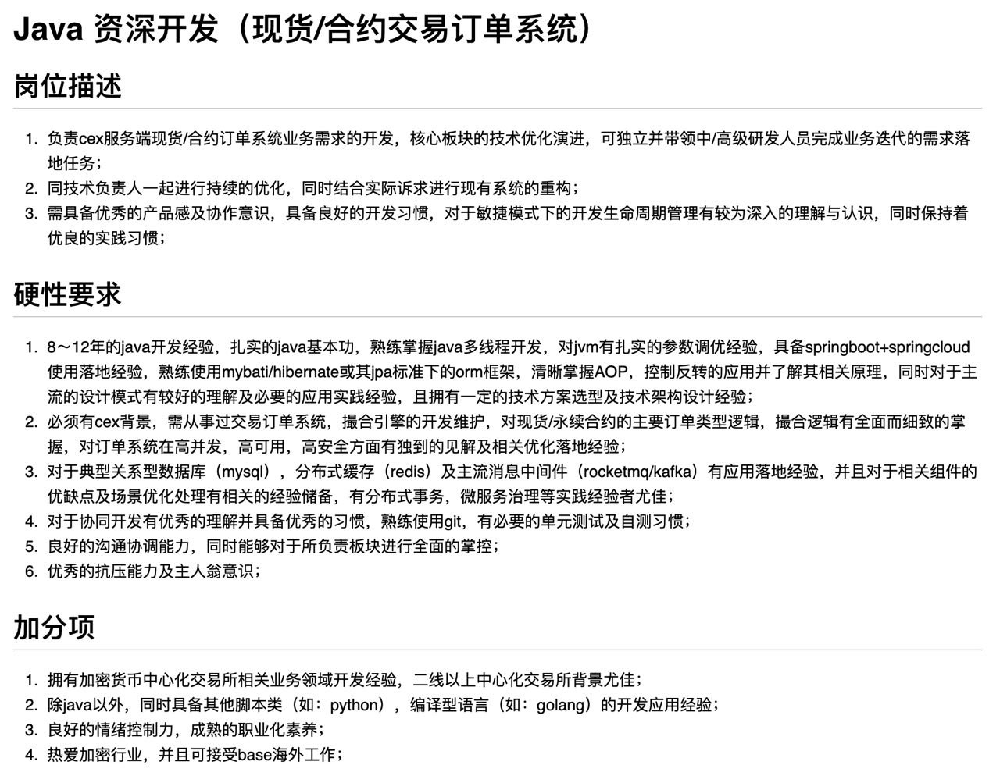

# 东南亚招聘信息

## 海外工作交流群

```
东南亚技术沟通群，提供东南亚最新、最全的技术招聘信息，找工作就进东南亚海外招聘群
https://t.me/hwlagoujob
```


## 2024-11-08 Intech- HR直招 官方频道

```
APP测试  —需要到马尼拉入职
薪资：3000-4500u

岗位职责： 
1. 负责 Android、iOS、h5、服务端等的测试工作； 
2. 根据产品特点，制定测试解决方案，测试用例的设计、编写及执行，缺陷跟踪； 
3. 测试过程中，主动总结，及时反馈暴露过程中的问题，并尝试改进测试方法和优化过程；

任职要求: 
1. 计算机及相关专业本科以上学历； 
2. 2 年以上软件测试经验，熟悉测试流程、测试规范； 
3. 熟悉掌握 ADB、fiddler、Postman 等测试工具使用； 
4. 熟练掌握功能测试和 APP 专项测试方法； 
5. 熟练掌握数据库基础知识和常用命令； 
6. 有较强的自学和独立解决问题的能力，能独立完成测试工作；对新技术保持敏感，具备较强 的技术钻研和学习能力，热爱测试工作，具有良好的沟通能力和团队协作精神；
```


## 2024-11-04 开云体育(泰国分部) 招聘Java专家

```
开云体育 — Base: 泰国

Java专家

薪资：50k-80k   10小时，月休4

任职要求：
1. 精通Java语言，善于解决各种Java的性能问题
2. 精通Java社区的主流框架，并且具备定制和扩展能力
3. 具备优秀的系统分析和设计能力，能提前针对项目情况做出合理的规划和设计
4. 具备良好的工具文化，能利用各类工具或者优化使用方式提升和改善团队效率
5. 有比较丰富的敏捷开发实践，对敏捷开发实践有比较深刻的认知者优先
6. 熟练掌握K8S、Service Mesh等云原生技术，有实操经验者优先
7. 持续学习，乐于分享，善于思考，善于总结归纳沉淀，具备优秀的分析和解决问题能力；
8. 乐观随和，具备优秀的团队协作精神，善于和各种背景的人合作
9. 有强烈的责任心和工作主动性，对待工作认真严谨！

岗位职责：
1. 研发和定制匹配公司业务特征的研发技术平台和支持性的框架。
2. 技术难点攻关。
3. 核心业务编码。
4. 架构设计与相关技术文档的编写。
5. 参与搭建、集成、维护、适配开发活动中需要用到的各种支持性平台。如：CICD等自动化流程工具。
6. 参与制定需求分析、编码、测试、运维等环节的技术标准。
7. 参与制定和优化需求分析、编码实现、测试验收、交付运维等流程方面的标准。
8. 参与制定和完善代码review的标准，确保标准能顺利的落地，能灵活满足多种不同要求下的代码质量控制需求。
9. 执行代码Review，保证签入代码符合一定的质量标准
10. 技术培训，提升团队整体的技术水平。
11. 人员的招聘和面试，为公司寻找人才。
```


## 2024-11-04 迪拜CEX公司 招聘Java资深开发



```
迪拜CEX公司

招聘岗位：后端经理

岗位职责：
1. 基于区块链的产品的设计和研发；
2. 根据系统需求和总体架构完成详细设计；
3. 负责区块链底层平台搭建，设计、开发、合约撮合代码调优；
4. 负责区块链相关技术指导研发工作，跟踪区块链前沿技术；

任职要求：
1、5年以上研发经验，3年以上架构设计经验，熟悉主流设计原则及模式；
2、精通Java，熟练应用各种开源框架如Spring、Spring Data、Spring Boot、Spring Cloud、了解底层原理;
3、了解golang、python，可以作为开发语言编写。
3、熟悉常见的后端架构和技术，在分布式系统设计、微服务架构、容器化部署、大数据处理等一个或多个领域有丰富的落地经验；
4、熟悉主流关系型和非关系型数据库（如MySQL、MongoDB，kafka，rudis），熟悉分布式缓存、消息队列、全文搜索等常用技术；
5、了解交易撮合系统，清结算系统，风控系统 原理，对以上内容有架构思想；
6、对量化交易有一定的了解。
7、有区块链交易所项目经验优先考虑；

薪资范围：50K~70K
```


## 2024-11-01 迪拜市中心 NQ科技

```
迪拜市中心技术公司

职位：高级Cocos 开发（Slots游戏）急招
薪资待遇：年薪 40W ~ 120W （不含项目奖金） 
工作时间：大小周（月休6天）
学历要求：本科或本科以上学历  

岗位职责：
1．参与游戏客户端的设计、开发，确保架构和实现满足整个系统的产品需求。
2．带领研发团队，组织团队完成技术架构的实现和维护，保持公司技术的核心竞争力，
3．制定和优化技术开发编码等规范和流程，设立明确无疑的目标衡量指标，把控程序质量，确保工作计划高效高质完成。
4．负责与其他部门在技术领域的沟通、合作、协调，帮助其他部门通过技术手段改进工作方法提高工作效率，

任职要求
1．计算机相关专业本科以上学历，8年以上行业技术经验，最近3年以上cocos creator高级开发经历。
2．精通TypeScript，深刻理解Cocos Creator的底层原理、性能优化和架构设计，能够编写高效、可维护的代码。
3．精通Cocos Creator编辑器的高级操作和插件开发，具有大规模项目的定制开发经验。
4．具备丰富的2D图形界面和动画制作经验，能够设计和实现复杂的游戏动画和特效表现，并进行表现优化。
5．具有丰富的代码调试和问题排查经验，能够解决复杂的引擎系统级的问题，并进行引擎系统级的优化。
6．具有引擎系统级的性能调优的经验，能够从FPS、DrawCall、CPU、GPU、内存等维度上提升游戏的运行效率。
7．具备深厚的跨平台开发经验，能够处理不同平台上的兼容性问题。
8. 有Slots游戏或棋牌游戏开发经验优先。
```


##  2024-11-01 WeeX交易所 招聘远程运维工程师

```
交易所招聘海外远程运维工程师一位，需要人base海外或者港澳台，远程工作。

岗位职责：
1. 參與公司雲平台的建設，升級，擴容，維護等
2. Kubernetes集群的監控與維護
3. Mysql/RDS 的監控，遷移，維護和優化
4. 中間件的安裝和維護
5. 參與公司安全實踐
6. 雲設備巡檢，告警規則定義和處理

岗位要求：
1. 熟悉Linux操作系統，對文件系統，網絡，存儲具有豐富的知識
2. 熟悉Kubernetes生態體系，包括網絡，存儲，架構等，熟悉Docker，具有Kubernetes集群的搭建，配置，管理經驗
3. 熟悉sql和Mysql，有mysql主從，集群運維經驗
4. 了解Python或Golang語言，熟練編寫Shell腳本
5. 2年以上的Kubernetes運維經驗，最好有自動化運維的經驗，具有優秀的解決問題能力
6. 熟悉Prometheus, Grafana, ELK等工具，具有監控，日誌，告警系統的實踐經驗；
7. 熟悉DevOps相關的工具鏈: Git, Jenkins；了解業界DevOps平台的相關技術體系
8. 熟悉AWS，例如EC2，EKS相關產品優先

薪资待遇：30-45k
```


## 2024-10-31 菲律宾-XIT游戏研发公司

```
岗位：后端(GO)开发工程师（急招）
项目：游戏项目
薪资：30-50k rmb

岗位要求
1. 本科或以上学历，3年及以上的go语言开发经验。有扎实的编程和debug能力。（掌握RUST/C/C++等语言可加分。）
2. 主导或参与过大型项目开发并取得杰出成效者优先，扎实的系统设计能力，能够针对业务需求提出合理的解决方案并进行实现。
3. 深刻理解数据结构和算法设计，扎实掌握分布式原理。
4. 对设计高并发、高性能、可横向扩展、可持续审计、高安全的集群系统，有过完整的实践（具备深入的理解亦可）。掌握系统性能瓶颈分析工具以及方法，对GO语言及现代编程语言利弊有深入的理解。
5. 有成功的大规模微服务实践经验，理解微服务组织原理，了解主流的微服务实现、部署及监控方案。
6. 熟悉常见的关系数据库、NewSQL、NoSQL、消息流系统解决方案。了解不同方案的利弊并能针对需求做出合理的权衡。
7. 熟悉 web3 ,区块链项目  等项目 开发经验者优先。
8. 熟悉Actor/CSP等高并发模型，有高性能分布式游戏服务器开发经验者优先。
9. 熟悉Linux操作系统，掌握系统性能调优，了解常用通信协议原理。
10. 熟悉Git flow，注重测试与文档，有良好的编程习惯。（开源项目贡献者可加分。）
11. 具备流畅的英文阅读能力，能够准确高效地查阅英文文档。
12. 对技术有强烈的好奇心，对工作有责任心，沟通能力优良，注重团队协作。
13. 具备超强的抗压能力，具备超高的安全意识，对系统设计要同时考虑性能和安全；
```


##　2024-10-30  YQ&XIT 招聘

```
【YQ&XIT】招聘

马来西亚岗位需求
吉隆坡
大小周，前期居家，后期到办公室
golang 后端专家/技术负责人
 岗位要求
1. 本科或以上学历，3年及以上的go语言开发经验。有扎实的编程和debug能力。（掌握RUST/C/C++等语言可加分。）
2. 主导或参与过大型项目开发并取得杰出成效者优先，扎实的系统设计能力，能够针对业务需求提出合理的解决方案并进行实现。
3. 深刻理解数据结构和算法设计，扎实掌握分布式原理。
4. 对设计高并发、高性能、可横向扩展、可持续审计、高安全的集群系统，有过完整的实践（具备深入的理解亦可）。掌握系统性能瓶颈分析工具以及方法，对GO语言及现代编程语言利弊有深入的理解。
5. 有成功的大规模微服务实践经验，理解微服务组织原理，了解主流的微服务实现、部署及监控方案。
6. 熟悉常见的关系数据库、NewSQL、NoSQL、消息流系统解决方案。了解不同方案的利弊并能针对需求做出合理的权衡。
7. 熟悉 web3 ,区块链项目  等项目 开发经验者优先。
8. 熟悉Actor/CSP等高并发模型，有高性能分布式游戏服务器开发经验者优先。
9. 熟悉Linux操作系统，掌握系统性能调优，了解常用通信协议原理。
10. 熟悉Git flow，注重测试与文档，有良好的编程习惯。（开源项目贡献者可加分。）
11. 具备流畅的英文阅读能力，能够准确高效地查阅英文文档。
12. 对技术有强烈的好奇心，对工作有责任心，沟通能力优良，注重团队协作。
13. 具备超强的抗压能力，具备超高的安全意识，对系统设计要同时考虑性能和安全；
有支付搭建经验优先
```


## 2024-10-29 马来游戏研发公司

```
UI设计师/组长   薪资 30~40
任职要求: 
1、对欧美市场审美有深入的了解，擅长各类风格界面设计，創意和色彩把握能力強，具備提升用戶使用感受的思維能力；。  
2、美术相关类专业毕业，良好的手繪創作能力，深厚的美术功底和平面设计基础。  
3、4年以上UI设计经验（網頁設計、移動端UI設計），有独立完成游戏项目设计经验或参与过海外休闲项目者尤佳。  
4、有较强的综合分析能力，创新能力，准确理解工作需求并高效完成。  
5、有较强的责任心，工作投入度高，配合前端工程師完成產品設計和研發团队目标。
6、具有用户界面设计相关专业技能，熟悉AE、Protopie等动效制作工具，有动效动画设计能力，能够设计符合用户体验的界面动效动画者优先考虑；

GOlang   薪资 30~50
工作职责： 
1. 负责公司产品接口的开发及维护； 
2.负责实现产品功能模块设计和文档编写； 
3.负责新技术的研究和测试；
4. 负责基础服务的功能设计及开发，对服务扩展保持前瞻性；
5. 深度参与需求讨论及功能设计，高质量完成产品交付，对产品质量和研发效率负责。

岗位要求：
1.  有三年以上后台开发经验；
2. 熟悉Go语言，有两年以上使用Go语言项目的开发经验；
3. 具备丰富的微服务设计经验，并在服务治理、服务监控方面有相关经验；
4. 有高并发、海量数据、大规模分布式系统设计经验；
5. 对数据库、缓存、队列及其他分布式系统组件的使用及优化有丰富经验；
6. 熟悉Linux/Unix系统常用命令，了解docker、kubernetes等容器技术；
7. 熟悉计算机网络，精通高性能网络编程，如异步通信、事件驱动、性能优化等；


Flutter开发工程师  薪资 30~50
工作职责：
1. 参与公司产品的开发，负责移动端应用的开发与维护；
2. 根据产品需求，设计并开发高质量的代码，确保应用程序的稳定性、可靠性和高性能；
3. 协同后端开发工程师完成应用程序的接口对接；
4. 参与产品需求讨论，提供技术方案和建议；
5. 跟进技术发展和行业动态，积极学习新技术。
任职要求：
1. 精通 Flutter 框架，有至少 2 年以上的 Flutter 开发经验；
2. 熟练掌握 Dart 语言，具备良好的代码风格和习惯；
3. 熟悉常用的软件开发流程和开发工具，如 Git、Jira、Jenkins 等；
4. 具备良好的团队协作能力和沟通能力，能够有效解决问题；
```


## 2024-10-29 迪拜 NQ科技集团

```
岗位需求更新:2024.10.6
1、技术总监PHP/go             年薪：300w起  
2、美术总监（Slots游戏） 年薪：200-600w
3、设计总监                            年薪：180-600W
4、游戏主美                            年薪：160-520W
5、PHP高级开发                   年薪： 60-115W
6、中高级GO                          年薪：75W-150W
7、开发运维                            年薪：40W-60W
8、游戏策划（Slots游戏） 年薪：110-220w
9、Cocos（Slots游戏）      年薪：40-120W
```


## 2024-10-29 菲大型游戏研发公司—Pioneers

```
Java技术专家  不限  —日本
（可先国内入职，试用期后到日本现场办公）

技能要求：
1、统招本科及以上学历（能力优秀可放宽）。
 2、7年以上使用JAVA开发的经验，对于用过的开源框架，能了解到它的原理和机制.
 3、在技术领域方面有一项擅长，比如分布式系统设计、业务建模、数据分析等。
 4、对Elasticsearch、Kafka、canal、rocketMQ、redis等有源代码分析问题经验，并实际解决业务问题。
 5、良好的沟通技能，跨团队合作能力，具有很强的问题分析和处理能力，有优秀的动手能力，热衷技术，精益求精。
 6、精通主流微服务技术框架（spring cloud、dubbo），并有项目实战经验。
 7、参与过异地多活容灾的架构设计、有技术中台架构设计经历优先录用。
 8、有团队管理经验者优先录用。

 备注：日本只招无BC经验，大专/以上学历

薪资待遇：面议  大小周


高级Java研发 不限  —日本
1、版本迭代开发以及自测
2、线上环境问题处理及维护
3、业务模块数据优化
4、问题修复
5、模块性能优化
6、其他事项

技能要求：
1、本科及以上，计算机相关专业，5年以上实际JAVA项目开发经验；
2、熟悉Spring Boot，Spring Cloud，Mybatis等主流开发框架；具备Spring Cloud和Web中后台管理系统实际项目开发经验；
3、具有扎实的java功底，熟悉jvm、web开发、缓存、多线程、分布式架构、分布式事务、消息中间件等技术；
4、深入理解面向对象的编程，了解常见的设计模式，熟悉微服务的架构模式，熟悉敏捷开发的开发模式；
5、熟练Linux常用命令，熟练编写Shell脚本，熟悉Nginx、Redis、Zookeeper、Kafka、RabbitMQ等相关技术

薪资待遇：
30-50K  大小周
```


## 2024-10-29  泰曼谷Bangkok 五区科技

```
🌸🌸老牌公司  五区科技  官方直聘🌸🌸
⛳️ 地点 |  🇹🇭泰曼谷Bangkok 【总】 | 🇵🇭菲Pasay【分】
👉  PHP高级开发工程师  3名  25-50k RMB   大牛另谈
👉  WEB前端工程师 3名   25-50k RMB   大牛另谈 
👉  IOS（flutter方向） 1名   25-50k RMB   大牛另谈
👉  运维工程师(DBA方向)（必须曼谷）  1名 20-50k RMB  
👉  ui   1名 20-40k RMB  大牛另谈

 每天8小时，曼谷市中心居家办公，单休
```


## 2024-10-28 托诺科技

```
⭐️💫托诺科技🔤🔤🔤⭐️💫
🔣正规招聘，不禁足，包吃住可外宿🔣

🌀安卓🌀Web前端🌀SEO
🌀PHP🌀JAVA🌀Flutter🌀go
🌀UI🌀平面设计🌀测试🌀爬虫
🌀内容运营🌀新媒体运营🌀运维
🌀产品经理🌀APP运营🌀渠道
🌀视频剪辑🌀文案编辑🌀运营助理
🌀客服🌀安保🌀后勤🌀财务

💲薪资范围：8-50K+绩效奖金
🥰休息休假：休中国节假日(带薪年假12天)
🥰工资准时发放，宿舍1-2人间
🥰福利：五险一金、医疗报销、年终奖、周年奖、生日/节日礼品、水果零食饮料、每月团建、KTV、按摩、带薪婚/病/产假
📍工作地点：金边
```


# 2024-10-28 迪拜 末来科技

```
迪拜市区别墅
纯技术公司直招
不压护照 不禁足 不打卡

VUE前端开发
运营（平台数据分析及活动策划）
JAVA架构师
JAVA工程师
运维工程师

💎员工权益💎
🧲宿舍标准：别墅   2人一间房
🧲电器配套：热水器，空调，冰箱，洗衣机，烧水壶等
🧲生活用品：床上三件套
🧲餐食：公司包一日四餐
🧲带薪年假：在职满半年后可享受 15 天的带薪年休假，并报销机票
🧲员工培训：公司拥有完善的培训体系
🧲工作签证：入职员工可根据自己意愿选择办理合法工作签证
🧲项目分红：根据项目盈利情况发放分红
🧲其他福利：无限量提供香烟、水果、饮料、零食、药品等
```


# 2024-10-28 金边 FOYA

```
⚡️⚡️𝐅𝐨𝐲𝐚传媒公司直招
💯不限制国籍、不禁足可外宿
✅技术岗位: 
➡️JAVA⚫️IOS⚫️UI⚫️SEO⚫️PHP⚫️Golang⚫️Node⚫️Python⚫️Flutter⚫️安卓⚫️中高运维⚫️Web前端⚫️高级爬虫⚫️脚本工程师⚫️产品经理⚫️平面设计⚫️网管⚫️技术全栈
✅运营岗位：
➡️运营主管⚫️运营组长⚫️中高级运营⚫️app运营⚫️产品运营⚫️内容运营⚫️渠道运营⚫️渠道商务⚫️运营组长⚫️自媒体运营⚫️流量运营⚫️品牌运营⚫️成人自媒体运营
✅职能岗位：
➡️HRBP⚫️招聘主管⚫️人事⚫️客服⚫️行政⚫️前台⚫️厨师⚫️财务⚫️新闻主编⚫️文案编辑⚫️监控管理员⚫️数据统计⚫️安保
💯工资准时发放➡️中国法定节假期
💯薪资范围12k-50k加奖金
💯🉐 13-16薪💰五险一金
🎯公司地址🇰🇭金边🇹🇼台北🇬🇧伦敦
```


# 2024-10-28 曼谷 鑫发

```
✅ 职位：交易所产品经理（急招）
✅ 要求：需有交易所经验 
✅ 招聘人数：1人
✅ 办公地址：泰国-曼谷

岗位职责：

1. 独立负责运营活动产品线的需求规划、产品设计、版本迭代、上线发布等产品优化周期的完整闭环工作。
2. 每日监控产品重点指标，深入用户使用场景，主动分析、挖掘产品数据，决定优化方向。
3. 依据调研、数据等分析结果，完成产品设计，包括界面原型、产品流程、业务规则等，并撰写产品设计文档。
4. 与运营、市场、设计、研发等团队沟通协作，推动产品迭代，高质量的完成项目上线。
5. 能准确把握项目目标和周期，与技术团队沟通协调，共同制定产品阶段计划，推动和协调产品的开发。


任职资格

1. 三年以上软件产品设计/产品经理相关工作经验，能够独立规划、设计产品。
2. 有运营后台产品经验者优先；有PMP等认证者优先；有区块链、衍生品交易经 验者优先。
3. 对数据敏感，较好的数据分析能力。
4. 较好的思考、学习能力，情绪稳定。
5. 较好的项目管理、沟通、学习能力。
```


# 2024-10-28 曼谷 鑫发

```
✅ 职位：交易所产品经理（急招）
✅ 要求：需有交易所经验 
✅ 招聘人数：1人
✅ 办公地址：泰国-曼谷

岗位职责：

1. 独立负责运营活动产品线的需求规划、产品设计、版本迭代、上线发布等产品优化周期的完整闭环工作。
2. 每日监控产品重点指标，深入用户使用场景，主动分析、挖掘产品数据，决定优化方向。
3. 依据调研、数据等分析结果，完成产品设计，包括界面原型、产品流程、业务规则等，并撰写产品设计文档。
4. 与运营、市场、设计、研发等团队沟通协作，推动产品迭代，高质量的完成项目上线。
5. 能准确把握项目目标和周期，与技术团队沟通协调，共同制定产品阶段计划，推动和协调产品的开发。


任职资格

1. 三年以上软件产品设计/产品经理相关工作经验，能够独立规划、设计产品。
2. 有运营后台产品经验者优先；有PMP等认证者优先；有区块链、衍生品交易经 验者优先。
3. 对数据敏感，较好的数据分析能力。
4. 较好的思考、学习能力，情绪稳定。
5. 较好的项目管理、沟通、学习能力。
```


